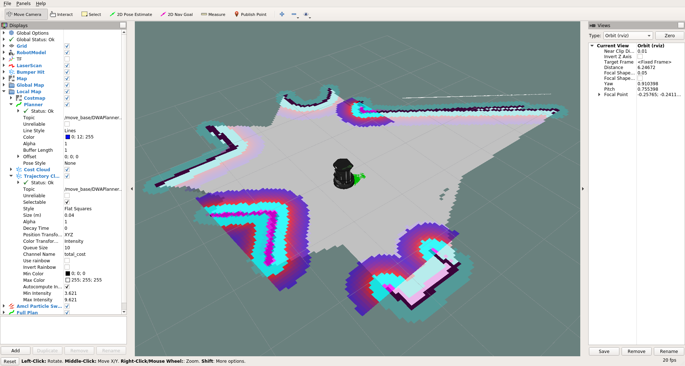
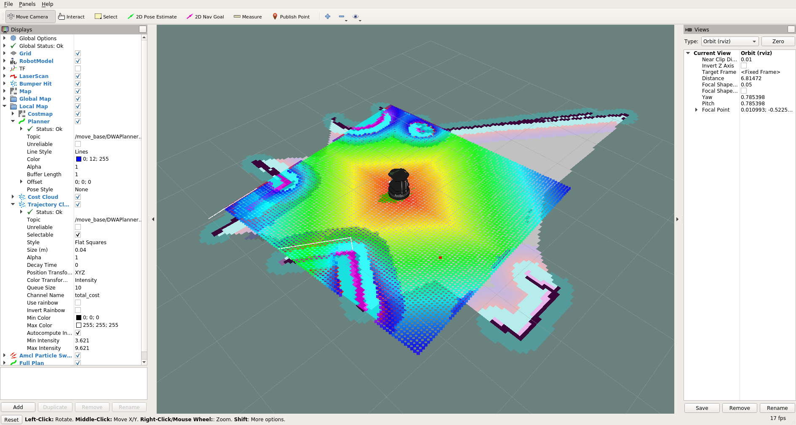

# turtlebot2 (on Melodic)

Why running turtlebot2 on Melodic? Why not?

reference: https://github.com/gaunthan/Turtlebot2-On-Melodic

In the workspace,
```
curl -sLf https://raw.githubusercontent.com/gaunthan/Turtlebot2-On-Melodic/master/install_basic.sh | bash
```

There seems a problem related to a missing plugin file, and it is necessary to compile the source of the plugin.
reference: https://github.com/gaunthan/Turtlebot2-On-Melodic/issues/2
Also it does not include turtlebot_rviz_launchers, so it must be separately added to the workspace.
To make a long story short,
```
mkdir temp
cd temp
git clone https://github.com/yujinrobot/kobuki_desktop.git
cp -R kobuki_desktop/kobuki_gazebo_plugins ../src/
git clone https://github.com/yujinrobot/yujin_ocs.git
cp -R yujin_ocs/yocs_velocity_smoother ../src/
git clone https://github.com/turtlebot/turtlebot_interactions.git
cp -R turtlebot_interactions/turtlebot_rviz_launchers ../src/
cd ..
rm -rf temp
sudo apt install ros-melodic-slam-gmapping
```

Finally,
```
catkin_make
```

## Run to create a map

Run Gazebo environment
```
roslaunch turtlebot_gazebo turtlebot_world.launch
```

_Note: The following steps are based on the tutorials to run an actual Turtlebot.
But you are running a simulated Turtlebot in Gazebo. You need to ignore `minimal.launch` and replace `turtlebot_navigation` with `turtlebot_gazebo`_
http://learn.turtlebot.com/2015/02/01/11/

Run gmapping
```
roslaunch turtlebot_gazebo gmapping_demo.launch
```
Run rviz
```
roslaunch turtlebot_rviz_launchers view_navigation.launch --screen
```
Run teleop
```
roslaunch turtlebot_teleop keyboard_teleop.launch
```

After moving the robot for a while, the map is constructed. Then save the map.
```
rosrun map_server map_saver -f /tmp/my_map
```
This repo also includes sample `my_map.yaml` + `my_map.pgm`

# Run to use the map

_Note: The following steps are based on the tutorials to run an actual Turtlebot.
But you are running a simulated Turtlebot in Gazebo. You need to ignore `minimal.launch` and replace `turtlebot_navigation` with `turtlebot_gazebo`_
http://learn.turtlebot.com/2015/02/01/14/

Again, run Gazebo environment
```
roslaunch turtlebot_gazebo turtlebot_world.launch
```
Run AMCL
```
roslaunch turtlebot_gazebo amcl_demo.launch map_file:=/tmp/my_map.yaml
```
Run rviz
```
roslaunch turtlebot_rviz_launchers view_navigation.launch --screen
```
Run teleop
```
roslaunch turtlebot_teleop keyboard_teleop.launch
```
After moving the robot around, it localizes itself in the map.


Then, kill the telop node and get the scripts to test
```
cd
git clone https://github.com/markwsilliman/turtlebot.git turtlebot_scripts
```

edit the script
```
vi ./go_to_specific_point_on_map.py
```
at line83, replace this line
```
position = {'x': 1.22, 'y' : 2.56}
```
with
```
position = {'x': -0.5, 'y' : -1.5}
```

Then,
```
python ~/helloworld/go_to_specific_point_on_map.py
```

Finally, it looks like this.

